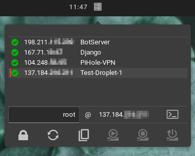

# Budgie Droplet Monitor Applet

## Monitor Digital Ocean Droplets for the Budgie Panel

### This applet is not associated in any way with DigitalOcean, LLC
### This applet will allow you to see the status of, start, and stop droplets

Work in progress...

Future plans:
* Get more detailed information
* allow launching SSH sessions to droplets
* more ?

Dependencies

* gtk+-3.0
* budgie-1.0
* gdk-3.0
* libpeas-gtk-1.0
* libsoup-2.4
* json-glib-1.0

i.e. for Debian based distros

To install (for Debian/Ubuntu):

    mkdir build
    cd build
    meson --prefix=/usr --libdir=/usr/lib
    ninja -v
    sudo ninja install

* for other distros omit libdir or specify the location of the distro library folder

This will:
* install plugin files to the Budgie Desktop plugins folder

